clone the repository and run the cpp server through WSL.
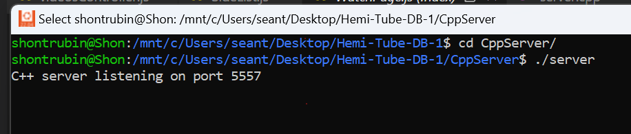
go to Server/Scripts and use the uploadUser and uploadVideo Scripts
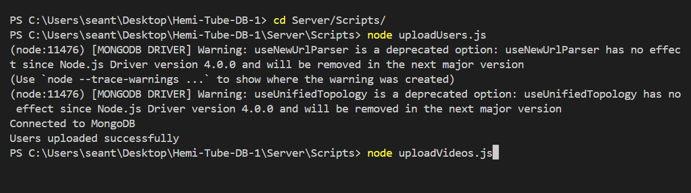
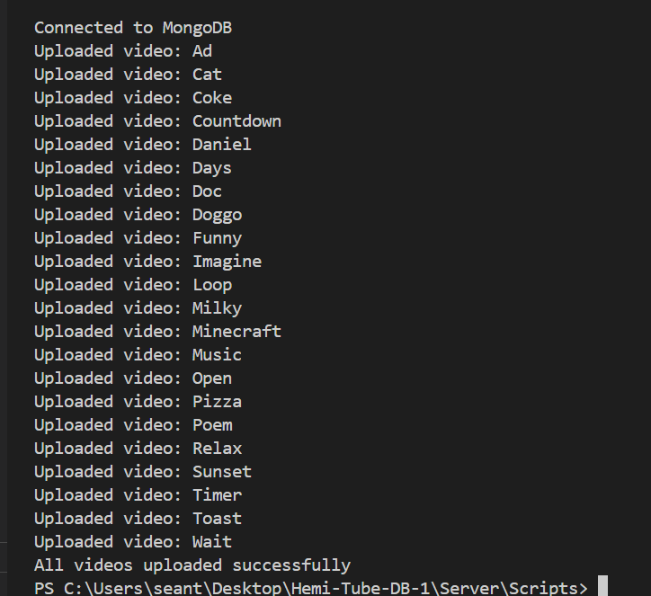
Go back to Server/ and run server.js
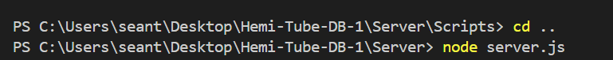
then go to the project folder and type npm start
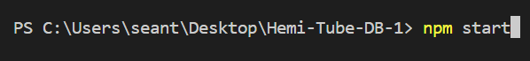
Press Y
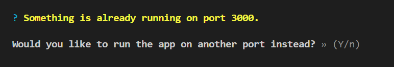
Now youtube is running, this is how it looks:
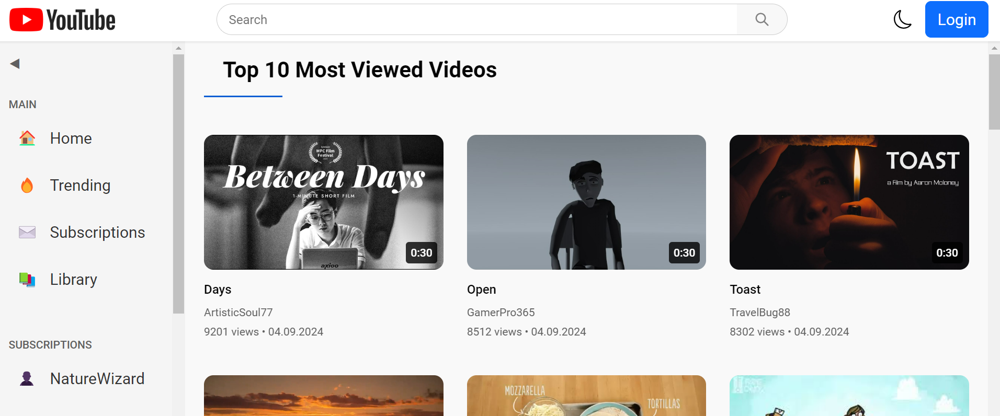
In the top right there is a Login button, click it to login.
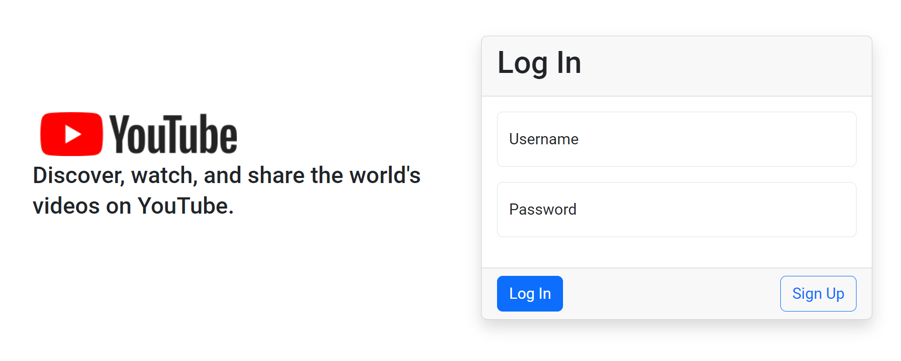
Now to register, click Sign up and fill out the form, including a profile picture
then it will send you back to the login screen and connect to the user you have just created
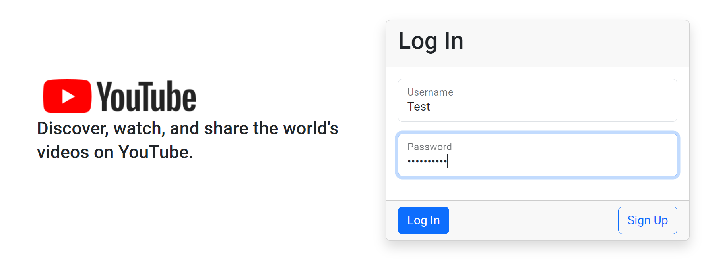
The top bar will change to this:

Click on the upload icon to uplaod a video and fill in the form
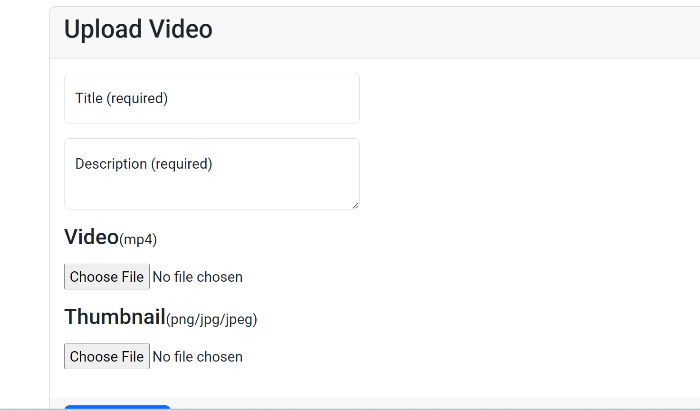
Now Click on the user profile picture in the top right and click on My Channel
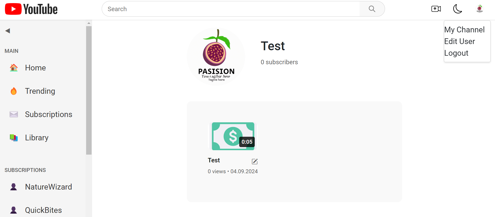
You can see the video and also edit if you click on the edit icon near the video,
to edit fill the form or you can also delete the video.
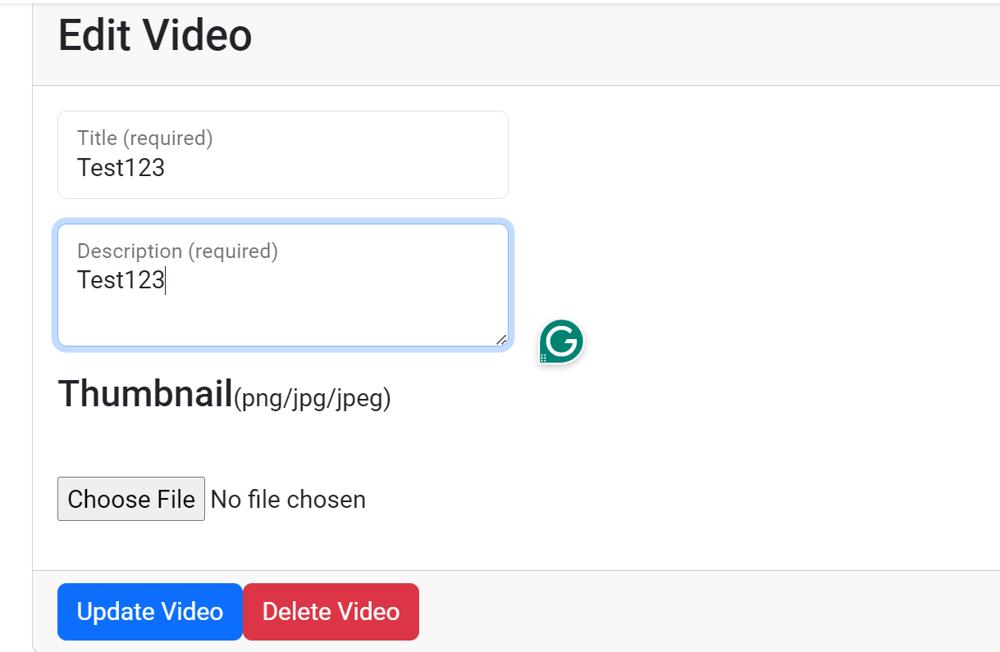
You can also comment on the video and edit/delete your comments
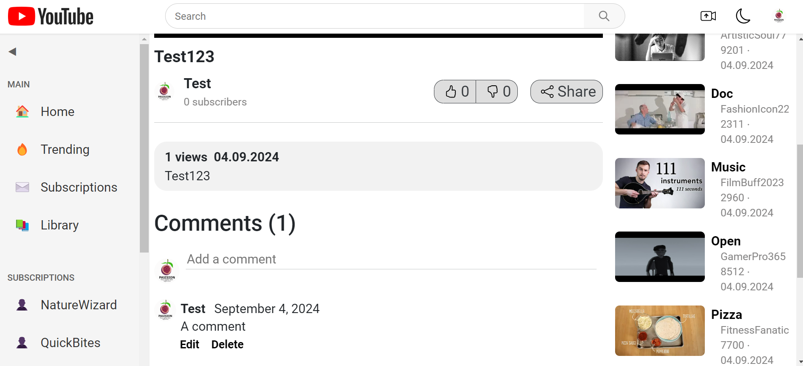
Enjoy out Youtube clone! :)
